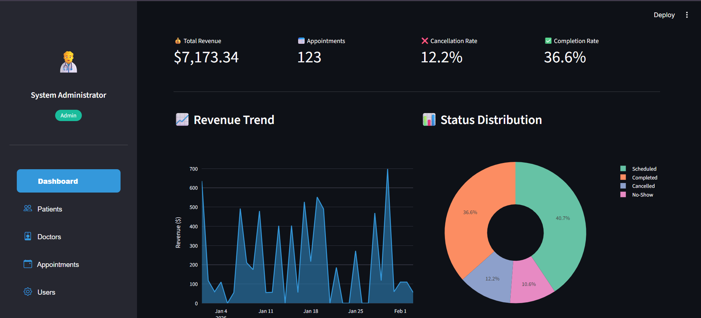
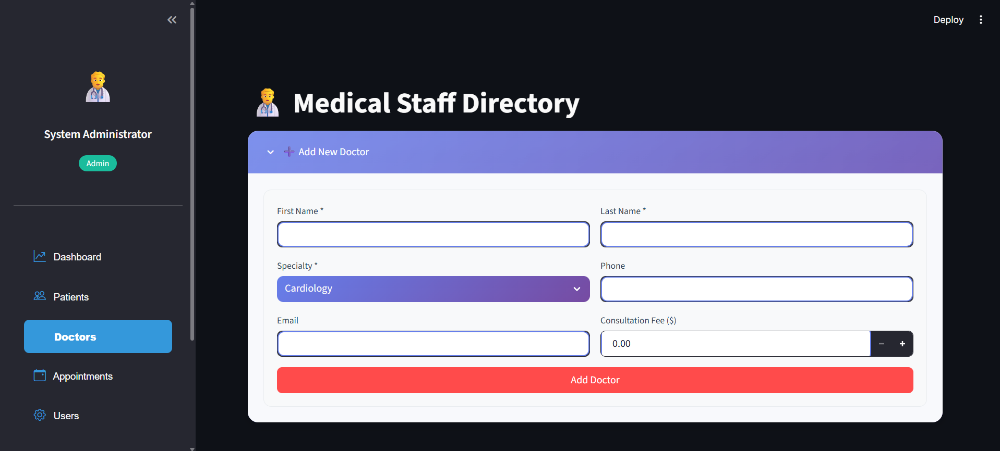
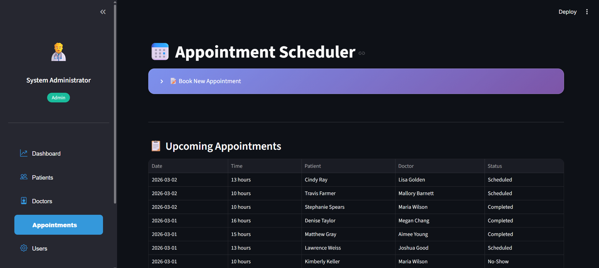
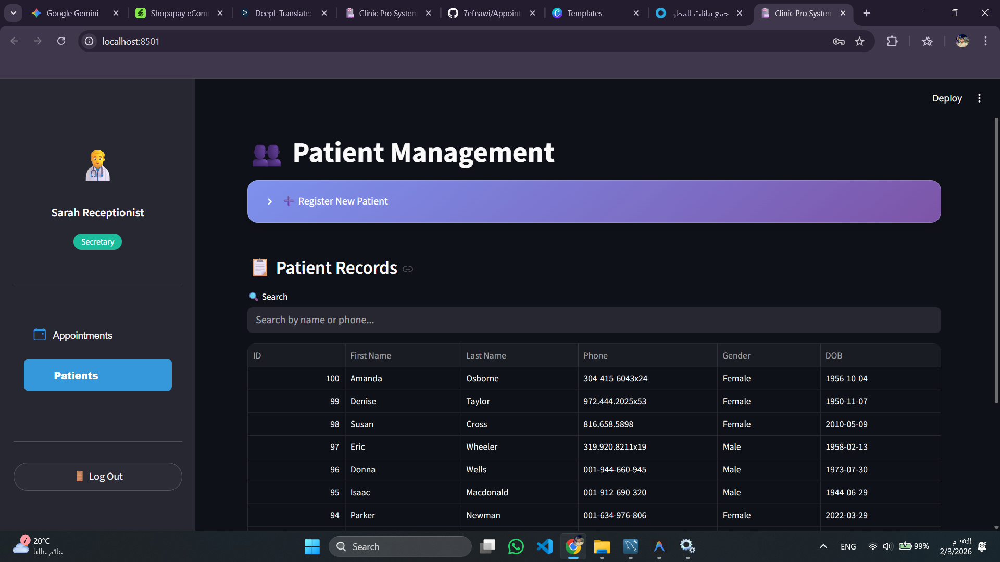

<h1 align="center">🏥 Clinic Pro System</h1>

<p align="center">
  <strong>Revolutionizing Healthcare Management, One Click at a Time</strong>
</p>

<p align="center">
  
  
  
  
</p>

---

## 🌟 What is Clinic Pro?

**Clinic Pro** is a modern, full-featured clinic management system designed to eliminate the chaos of paper-based appointments and scattered patient records. Built with Python and Streamlit, it provides an intuitive interface for doctors, secretaries, and administrators to manage their daily operations seamlessly.

> *"From patient registration to invoice generation — all in one elegant dashboard."*

---

## ✨ Key Features

| Feature | Description |
|---------|-------------|
| 🔐 **Secure Authentication** | Role-based access control (Admin, Doctor, Secretary) with SHA-256 password hashing |
| 📊 **BI Dashboard** | Real-time analytics with revenue trends, cancellation rates, and doctor performance charts |
| 🩺 **Doctor Console** | Dedicated view for doctors to manage consultations, diagnoses, and prescriptions |
| 📅 **Smart Booking** | Appointment scheduling with automatic double-booking prevention |
| 👥 **Patient Management** | Complete patient registry with search and filtering capabilities |
| 💊 **Prescription System** | Digital prescription generation linked to consultations |
| 💰 **Auto-Invoicing** | Automatic invoice creation when consultations are completed |

---

## 🛠️ Tech Stack

| Layer | Technology |
|-------|------------|
| **Frontend** | Streamlit, Plotly Express |
| **Backend** | Python 3.10+ |
| **Database** | MySQL 8.0+ |
| **Auth** | SHA-256 Hashing |
| **Styling** | Custom CSS, Inter Font |

---

## 🚀 Quick Start

### Prerequisites
- Python 3.10 or higher
- MySQL 8.0 or higher
- pip (Python package manager)

### Installation

```bash
# 1. Clone the repository
git clone https://github.com/yourusername/clinic-pro-system.git
cd clinic-pro-system

# 2. Install dependencies
pip install -r requirements.txt

# 3. Setup the database
# Open MySQL and run:
mysql -u root -p < ClinicDB.sql

# 4. Launch the application
streamlit run app.py
```

### Default Credentials
| Role | Username | Password |
|------|----------|----------|
| Admin | `admin` | `admin123` |

> 💡 **Tip:** Create Doctor and Secretary users through the Admin → Users panel.

---

## 📸 Screenshots

<p align="center">
  <i>Add your screenshots here</i>
</p>

| Dashboard | Doctor Console |
|-----------|----------------|
|  |  |
| *Executive analytics with revenue trends* | *Doctor's daily consultation queue* |

| Appointments | Patient Management |
|--------------|-------------------|
|  |  |
| *Smart booking with conflict detection* | *Complete patient registry* |

---

## 📁 Project Structure

```
clinic-pro-system/
├── app.py              # Main Streamlit application
├── ClinicDB.sql        # Database schema
├── requirements.txt    # Python dependencies
├── README.md           # This file
├── DOCS.md             # Full system documentation
└── screenshots/        # Application screenshots
```

---

## 📖 Documentation

For detailed system documentation, workflows, and architecture explanations, see **[DOCS.md](DOCS.md)**.

---

## 🤝 Contributing

Contributions are welcome! Please feel free to submit a Pull Request. For major changes, please open an issue first to discuss what you would like to change.

---
